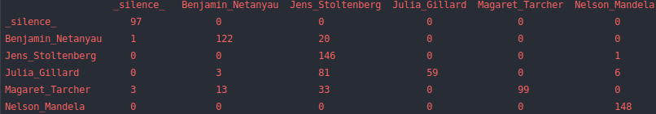

# SpeakerRecognition
This project is a complete example of doing speaker recognition/ classification on an 
android device using deep learning. The model tries to distinguish the voices of the 
following prominent leaders; Benjamin Netanyahu, Jens Stoltenberg, Julia Gillard, Margaret
Tacher and Nelson Mandela. I used 
[this](https://github.com/tensorflow/docs/blob/master/site/en/r1/tutorials/sequences/audio_recognition.md) 
TensorFlow Example as a starter.

# Dataset
The dataset can be downloaded from [Kaggle](https://www.kaggle.com/kongaevans/speaker-recognition-dataset). 
It contains the speeches of the above 
mentioned leaders, each audio is one second long 16000 sample rate PCM encoded.


# The Model Architecture
The model is made up of audio feature extraction and neural networks. The first layer of
the model does audio processing, which includes computing Spectrogram's or Melspectrograms
which are built using TensorFlow Keras layers.
The reason for building audio processing using keras layers was to provide easy model
conversion to TFLite since the model is to be deployed to android and also to do feature
computation on the GPU while training. The audio processing 
layers are implemented in a library called [Spela](https://github.com/kongkip/spela).

The following architecture is a convolutional 2D layer followed by a maximum pooling 
layer, then a flattening layer. Last layer is a Dense layer with a softmax function.

# Training
The model is trained by running the following script
```bash
python train.py -data_dirs 16000_pcm_speeches
```
where the 16000_pcm_speeches is the dataset. While training model accuracy is computed then
display a confusion matrix at the end of one epoch.

The confusion matrix looks like



Training creates a checkpoint folder and saves best model weights.

# Model Conversion
Saved weights are loaded and model converted to TFLite using the following script
```bash
python reconstruct_model_and_coonvert.py
```


# Android Demo
The android app is built using Kotlin language.
